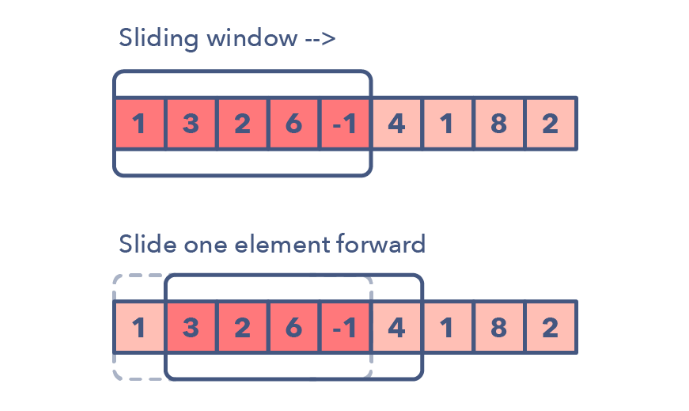

# Sliding Window

The Sliding Window pattern is used to perform a required operation on a specific window size of a given array or linked list, such as finding the longest subarray containing all 1s. Sliding Windows start from the 1st element and keep shifting right by one element and adjust the length of the window according to the problem that you are solving. In some cases, the window size remains constant and in other cases the sizes grows or shrinks.

Sliding Window Questions fall under the following categories:

>+ [Sliding Window of constant window size](#sliding-window-of-constant-window-size) 
>+ [Sliding Window in which window size increases depending on the constraints](#sliding-window-in-which-window-size-increases-depending-on-the-constraints)
>+ [Sliding window in which sliding window length will expand and then shrink](#sliding-window-in-which-sliding-window-length-will-expand-and-then-shrink)

## Sliding Window of constant window size

As stated, the window size will remain constant. Two pointers are maintained to store the index of the start and end of the sliding window. In each step, both pointers, lets say left and right, will be incremented by 1.



Small code snippet of the sliding window concept:

```python
    # Create an Sliding Window of Size len(p) 
    for ch in s[:len(p)]:
        s_list[dictionary[ch]] += 1
    
    if s_list == p_list:
        result.append(0)
    
    # For each step 
    for i, ch in enumerate(s[len(p):]):
        # Remove the starting element from the window
        s_list[dictionary[s[i]]] -= 1
        # Add the new element, Window size remains constant
        s_list[dictionary[ch]] += 1
        if s_list == p_list:
            result.append(i+1)
    return result
```

Some problems on Leetcode that can be solved using this concept:

### Medium Level

1. [438. Find All Anagrams in a String](https://leetcode.com/problems/find-all-anagrams-in-a-string/)
2. [567. Permutation in String](https://leetcode.com/problems/permutation-in-string/)
3. [1052. Grumpy Bookstore Owner](https://leetcode.com/problems/grumpy-bookstore-owner/)
4. [1423. Maximum Points You Can Obtain from Cards](https://leetcode.com/problems/maximum-points-you-can-obtain-from-cards/)
5. [1456. Maximum Number of Vowels in a Substring of Given Length](https://leetcode.com/problems/maximum-number-of-vowels-in-a-substring-of-given-length/)

### Hard Level

1. [239. Sliding Window Maximum](https://leetcode.com/problems/sliding-window-maximum/)
2. [480. Sliding Window Median](https://leetcode.com/problems/sliding-window-median/)
3. [995. Minimum Number of K Consecutive Bit Flips](https://leetcode.com/problems/minimum-number-of-k-consecutive-bit-flips/)


## Sliding Window in which window size increases depending on the constraints


## Sliding window in which sliding window length will expand and then shrink