# STACK
Stacks are dynamic data structures that follow the Last In First Out (LIFO) principle. The last item to be inserted into a stack is the first one to be deleted from it.

Only 2 Supported Operations :
1. Push
2. Pop

Problems in stack can be categorized into :
1. [Basic Stack Operations Problems](#basic-stack-operations-problems)
2. [Monotonous Increasing](#monotonous-increasing-stack) / [Decreasing](#monotonous-decreasing-stack) Stack Problems


## Basic Stack Operations Problems
The key things to focus while solving problems on stack is :
1. What should be pushed to stack
2. When should the elements of stack be popped

For Example:

[20.Valid Parentheses](https://leetcode.com/problems/valid-parentheses/)

We push Whenever an opening brace  ```'{', '(', '['```  is encountered and pop when closing brace is encountered  ```'}', ')', ']'``` 

[394. Decode String](https://leetcode.com/problems/decode-string/)

In this problem, we push an element when an opening brace ``` '['``` is encountered. Pop the element off the stack when a closing brace ``` ']' ``` is encountered. After popping an element off the stack, we perform an operation on the popped element and add it to the element at the top of the stack.

Small code snippet of the operations performed:
```python
        for ch in s:
            if ch.isdigit():
              num += ch
            elif ch == '[':
                stack.append(["", int(num)])
                num = ""
            elif ch == ']':
                st, k = stack.pop()
                stack[-1][0] += st*k
            else:
                stack[-1][0] += ch
```

### List of Problems that fall into this Category:

#### Easy
1. [20. Valid Parentheses](https://leetcode.com/problems/valid-parentheses/)
2. [155. Min Stack](https://leetcode.com/problems/min-stack/)


#### Medium
1. [394. Decode String](https://leetcode.com/problems/decode-string/)
2. [636. Exclusive Time of Functions](https://leetcode.com/problems/exclusive-time-of-functions/)
3. [735. Asteroid Collision](https://leetcode.com/problems/asteroid-collision/)
4. [856. Score of Parentheses](https://leetcode.com/problems/score-of-parentheses/)
5. [895. Maximum Frequency Stack](https://leetcode.com/problems/maximum-frequency-stack/)
6. [921. Minimum Add to Make Parentheses Valid](https://leetcode.com/problems/minimum-add-to-make-parentheses-valid/)
7. [946. Validate Stack Sequences](https://leetcode.com/problems/validate-stack-sequences/)
8. [1081. Smallest Subsequence of Distinct Characters](https://leetcode.com/problems/smallest-subsequence-of-distinct-characters/)
9. [1190. Reverse Substrings Between Each Pair of Parentheses](https://leetcode.com/problems/reverse-substrings-between-each-pair-of-parentheses/)
10. [1249. Minimum Remove to Make Valid Parentheses](https://leetcode.com/problems/minimum-remove-to-make-valid-parentheses/)

#### Hard
1. [224. Basic Calculator](https://leetcode.com/problems/basic-calculator/)
2. [316. Remove Duplicate Letters](https://leetcode.com/problems/remove-duplicate-letters/)
3. [726. Number of Atoms](https://leetcode.com/problems/number-of-atoms/)
4. [772. Basic Calculator III](https://leetcode.com/problems/basic-calculator-iii/)

### Questions and Solutions in one place for quick reference

#### Easy

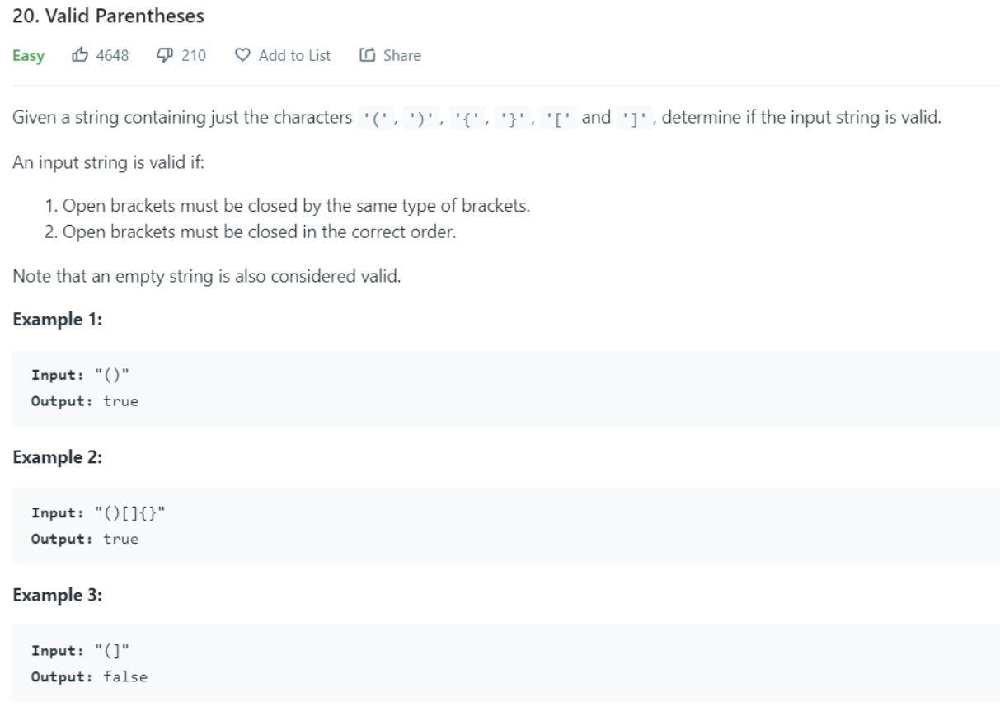

Solution:
```python
class Solution(object):
    def isValid(self, s):

        pair = {
            ')':'(',
            '}':'{',
            ']':'['
        }
        in_braces = ['(','{','[']
        stack = []
        for index,inp in enumerate(s):
            if index == 0 and inp not in in_braces:
                return False
            
            if inp in in_braces:
                stack.append(inp)
            else:
                pair_i = pair[inp]
                if stack and (pair_i == stack[-1]):
                    stack.pop()
                    continue
                else:
                    stack.append(inp)
                    break
        return not stack
```
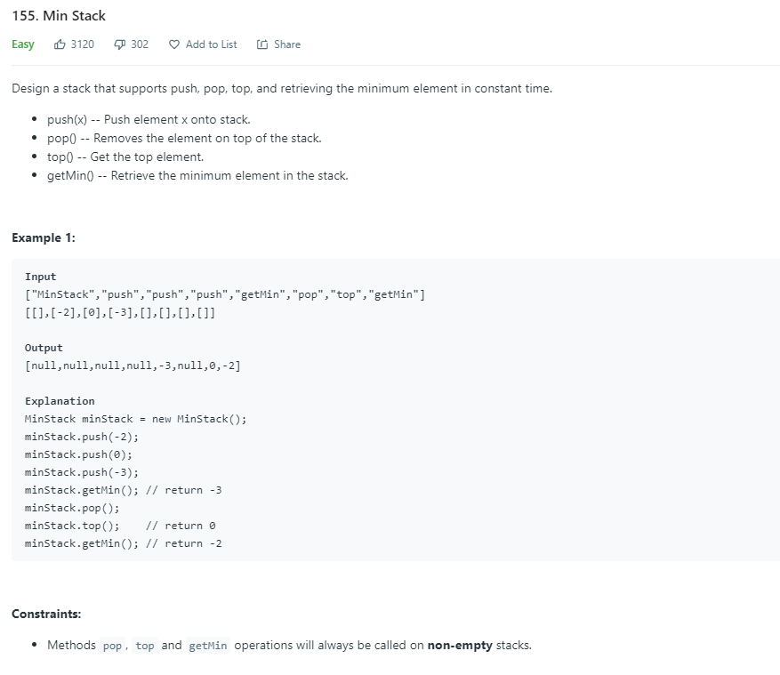

Solution:
```python
class MinStack:

    def __init__(self):
        self.q = []

    # @param x, an integer
    # @return an integer
    def push(self, x):
        curMin = self.getMin()
        if curMin == None or x < curMin:
            curMin = x
        self.q.append((x, curMin));

    # @return nothing
    def pop(self):
        self.q.pop()


    # @return an integer
    def top(self):
        if len(self.q) == 0:
            return None
        else:
            return self.q[len(self.q) - 1][0]


    # @return an integer
    def getMin(self):
        if len(self.q) == 0:
            return None
        else:
            return self.q[len(self.q) - 1][1]
```
#### Medium

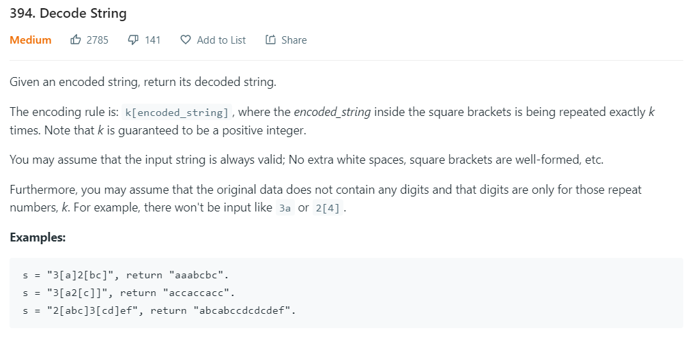

Solution: 
```python
class Solution(object):
    def decodeString(self, s):
        stack = []
        stack.append(["", 1])
        num = ""
        for ch in s:
            if ch.isdigit():
              num += ch
            elif ch == '[':
                stack.append(["", int(num)])
                num = ""
            elif ch == ']':
                st, k = stack.pop()
                stack[-1][0] += st*k
            else:
                stack[-1][0] += ch
        return stack[0][0]
        
```
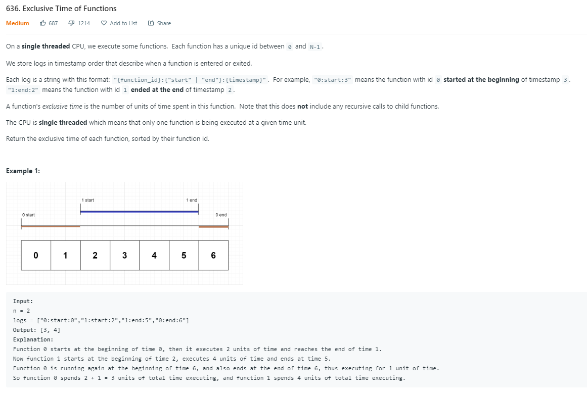

Solution: 
```python
class Solution:
    def exclusiveTime(self, n: int, logs: List[str]) -> List[int]:
        stack = []
        res = [0 for _ in range(n)]
        
        # stack --> [[ID, start_time, otherTasks_time] , ....]
        for log in logs:
            logSplit = log.split(':')
            if not stack or logSplit[1] == 'start':
                otherTasks = 0
                stack.append([logSplit[0], logSplit[2], otherTasks])

            else:

                res[int(logSplit[0])] += int(logSplit[2]) - int(stack[-1][1]) + 1 - stack[-1][2]
                otherTasks = int(logSplit[2]) - int(stack[-1][1]) + 1
                stack.pop()
                # after popping, update the top of the stack's otherTasks_time
                if stack:
                    stack[-1][2] += otherTasks     
```

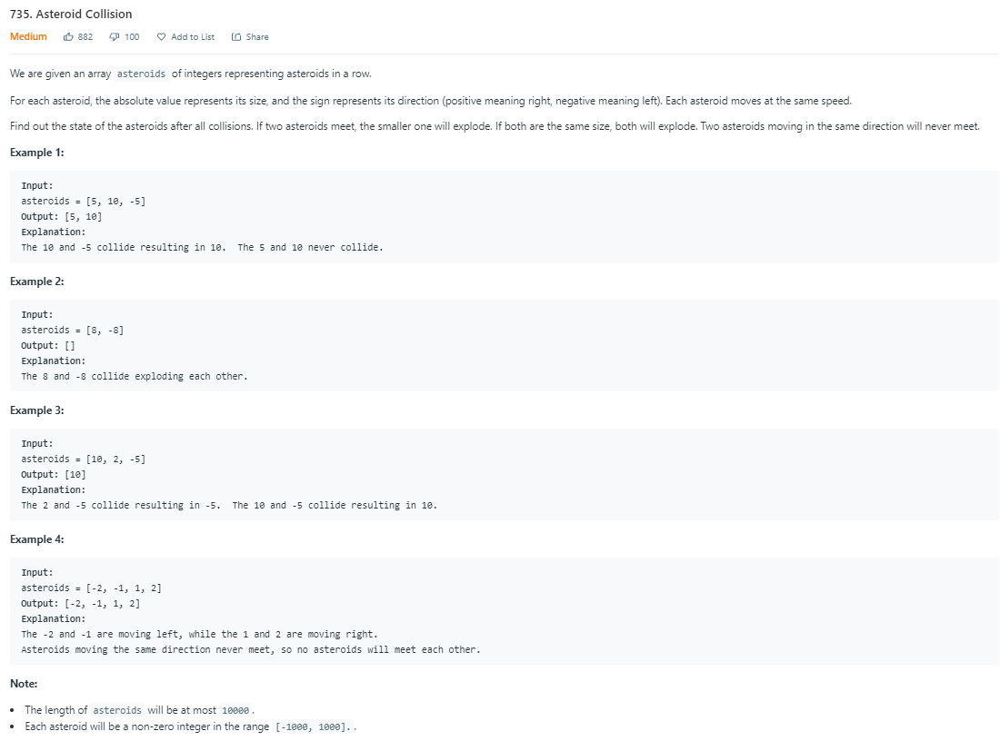

Solution: 
```python
class Solution:
    def asteroidCollision(self, asteroids: List[int]) -> List[int]:
        stack = []
        for asteroid in asteroids:
            if not stack:
                stack.append(asteroid)
            else:
                # Pop it off when, stack[-1] > 0 and asteroid < 0 and stack[-1] < abs(asteroid)
                while stack and stack[-1] > 0 and asteroid < 0 and stack[-1] < abs(asteroid):
                    stack.pop()
                # Pop and continue, when the magnitude is same 
                if stack and stack[-1] > 0 and asteroid < 0 and stack[-1] == abs(asteroid):
                    stack.pop()
                    continue
                # append
                elif not stack or (stack[-1] < 0 and asteroid < 0) \
                            or (stack[-1] > 0 and asteroid > 0) or (stack[-1] < 0 and asteroid > 0):
                    stack.append(asteroid)
        return stack
```
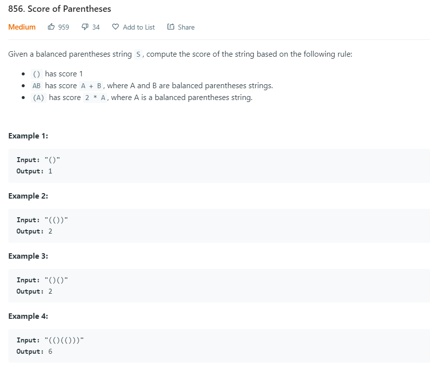

Solution: 
```python
class Solution:
    def scoreOfParentheses(self, S: str) -> int:
        if not S:
            return 0
        stack = []
        for i in range(len(S)):
            # append to the stack if it is an opening braces
            if S[i] == '(':
                stack.append(S[i])
            else:
                # if opening braces is encountered, pop it off the stack and append 1
                if stack[-1] == '(':
                    stack.pop()
                    stack.append(1)
                else:
                    num = 0
                    # multiply by 2 if digit is encountered at the top of the stack
                    while stack[-1] != '(':
                        num = num + ( 2 * stack.pop() )
                    if stack[-1] == '(':
                        stack.pop()
                        stack.append(num)
        return sum(stack)
```

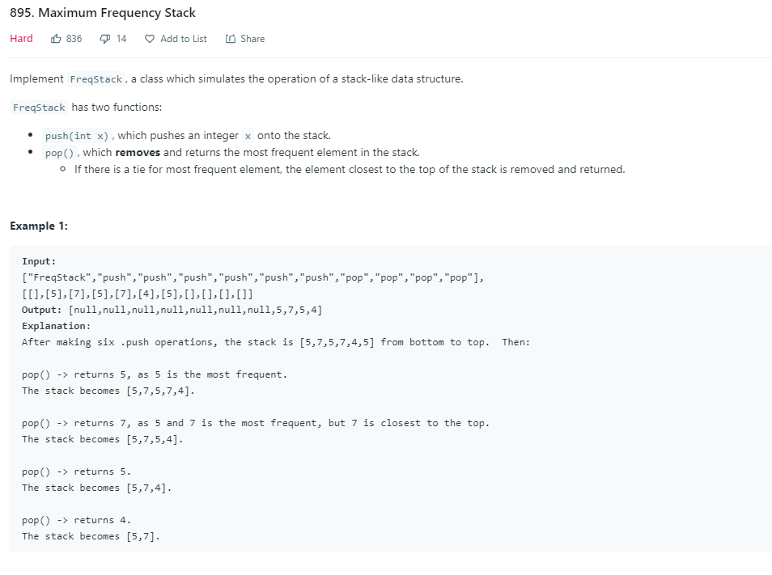

Solution: 
```python
class FreqStack:

    def __init__(self):
        self.maxFreq = 0
        self.valFreq_dict = defaultdict(int)
        self.freqVals_dict = defaultdict(list)

    def push(self, x: int) -> None:
        freq = self.valFreq_dict[x] + 1
        self.valFreq_dict[x] += 1
        if freq > self.maxFreq:
            self.maxFreq += 1
        self.freqVals_dict[freq].append(x)
        

    def pop(self) -> int:
        val = self.freqVals_dict[self.maxFreq].pop()
        if not self.freqVals_dict[self.maxFreq]:
            self.maxFreq -= 1
        self.valFreq_dict[val] -= 1
        return val
```

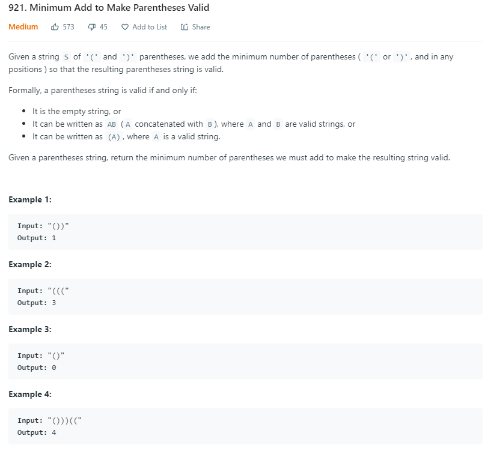

Solution:
```python
class Solution:
    def minAddToMakeValid(self, S: str) -> int:
        stack = []
        for ch in S:
            if stack and stack[-1] == '(' and ch == ')':
                stack.pop()
                continue
            stack.append(ch)
        return len(stack)             
```

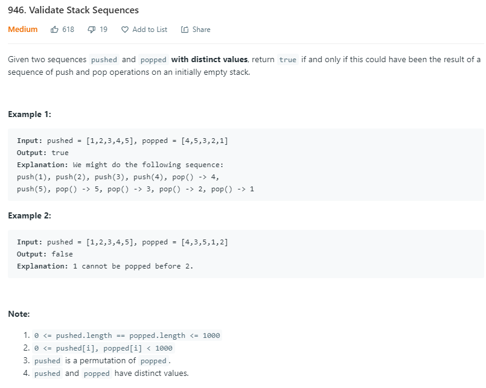

Solution:
```python
class Solution:
    def validateStackSequences(self, pushed: List[int], popped: List[int]) -> bool:
        if not pushed:
            return True
        i = j = 0
        stack = []
        while j < len(popped):
            # Add elements to the stack as long as popped[j] != pushed[i]
            while i < len(pushed) and popped[j] != pushed[i]:
                stack.append(pushed[i])
                i += 1
            # Skip
            if i < len(pushed) and popped[j] == pushed[i]:
                j += 1
                i += 1
            # Pop the elements
            while stack and stack[-1] == popped[j]:
                stack.pop()
                j += 1
            if i == len(pushed) and stack and stack[-1] != popped[j]:
                return False
        return True
```

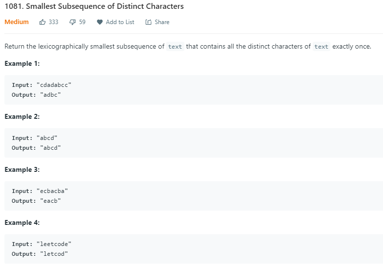

Solution:
```python
class Solution:
    def smallestSubsequence(self, text: str) -> str:
        rindex = {c: i for i, c in enumerate(text)}
        stack = []
        for i, c in enumerate(text):
            if c not in stack:
                while stack and c < stack[-1] and i < rindex[stack[-1]]:
                    stack.pop()
                stack.append(c)
        return ''.join(stack)
```

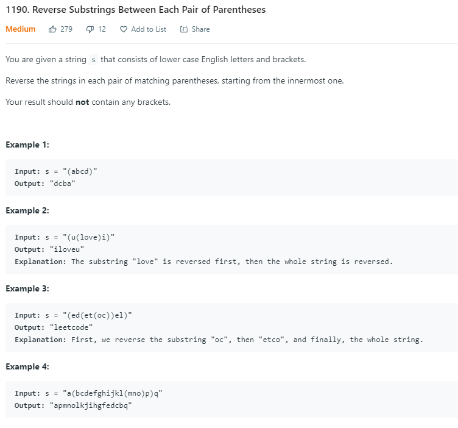

Solution:
```python
class Solution:
    def reverseParentheses(self, s: str) -> str:
        
        def reverse(string):
            return string[-1::-1]
        
        stack = ['']
        i = 0
        while i < len(s):
            
            # append to stack
            if s[i] == '(':
                stack.append('')
                
            # reverse the string, pop and ((append to stack) or (add to top of stack))
            elif s[i] == ')':
                rev_str = reverse(stack[-1])
                stack.pop()
                if not stack:
                    stack.append(rev_str)
                else:
                    stack[-1] += rev_str
                    
            # add to top of stack
            else:
                stack[-1] += s[i]
            
            i += 1
        return stack[-1]
```

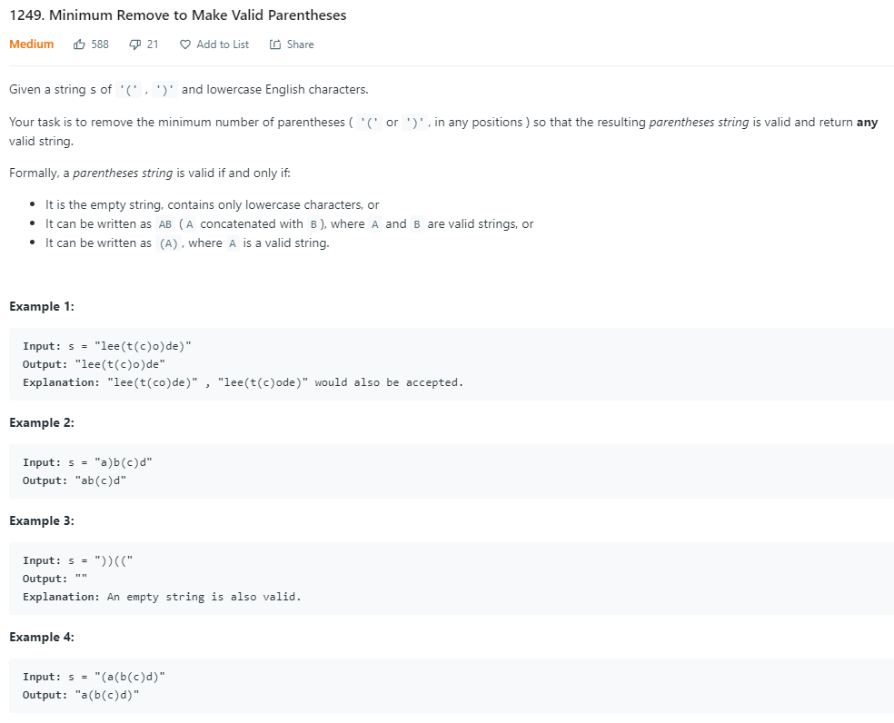

```python
from collections import deque

class Solution:
    def minRemoveToMakeValid(self, s: str) -> str:
        queue = deque()
        
        # queue will store all the incorrect braces. Ex: [(index, braces),..] 
        for i in range(len(s)):
            if not s[i].isalpha():
                if queue and queue[-1][1] == '(' and s[i] == ')':
                    queue.pop()
                    continue
                queue.append([i, s[i]])
                
        res_str = ''
        for i in range(len(s)):
            if (queue and queue[0][0] == i):
               queue.popleft()
            else:
                res_str += s[i]
        return res_str
```

#### Hard

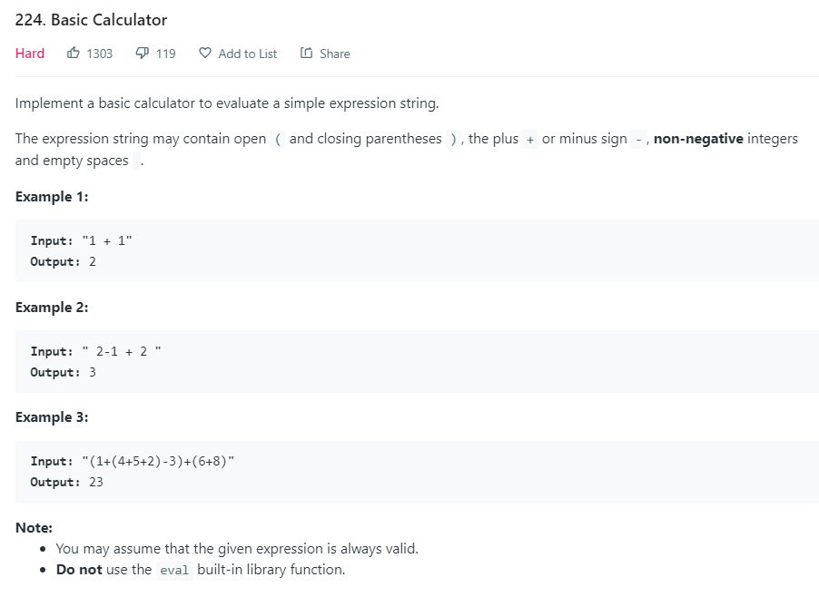

Solution:
```python
class Solution:
    def calculate(self, s: str) -> int:

        ## APPROACH : 2 STACKS ##
        ## SIMILAR TO LEETCODE 772. BASIC CALCULATOR III ##
        
        ## BELOW IS 100% SAME SOLUTION OF LEETCODE 772 ###

        def operation(op, second, first):
            if op == "+":
                return first + second
            elif op == "-":
                return first - second
            elif op == "*":
                return first * second
            elif op == "/":  # integer division
                return first // second
        
        def precedence(current_op, op_from_ops):
            if( op_from_ops == "(" or op_from_ops == ")" ):
                return False
            if(current_op == "*" or current_op == "/") and (op_from_ops == "+" or op_from_ops == "-"):
                return False
            return True
        
        if not s: return 0
        
        nums = [] if(s[0] !='-') else [0]                                       # edge case -1 + 2/3
        ops = []
        i = 0
        while i < len(s):
            c = s[i]
            if c == " ":
                i += 1
                continue
            elif c.isdigit():
                num = int(c)
                while i < len(s) - 1 and s[i + 1].isdigit():                    # more than 1 digit numbers
                    num = num * 10 + int(s[i + 1])
                    i += 1
                nums.append(num)
            elif c == "(":
                ops.append(c)
                if( i+1 < len(s) and s[i+1] == '-'): 
                    nums.append(0)                                              # "1 - (-7)" edge case.
            elif c == ")":
                while ops[-1] != "(":                                           # do the math when we encounter a ')' until '('
                    nums.append(operation(ops.pop(), nums.pop(), nums.pop()))
                ops.pop()                                                       # watch out, popping open brace '('
            elif c in ["+", "-", "*", "/"]:
                while len(ops) != 0 and precedence(c, ops[-1]):                 # check for precedence order and make calculations, APPEND RESULT TO NUMS STACK EVERY TIME.
                    nums.append(operation(ops.pop(), nums.pop(), nums.pop()))   
                ops.append(c)                                                   # append to operators stack
            i += 1                                                              # basic while loop increment
        
        while len(ops) > 0:                                                     # finally we perform calculations till stack is empty.
            nums.append(operation(ops.pop(), nums.pop(), nums.pop()))
            
        return nums.pop()
```

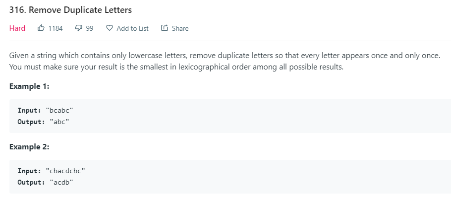

Solution:
```python
class Solution:
    def removeDuplicateLetters(self, s: str) -> str:
        rindex = {c: i for i, c in enumerate(s)}
        stack = []
        for i, c in enumerate(s):
            if c not in stack:
                while stack and c < stack[-1] and i < rindex[stack[-1]]:
                    stack.pop()
                stack.append(c)
        return ''.join(stack)
```

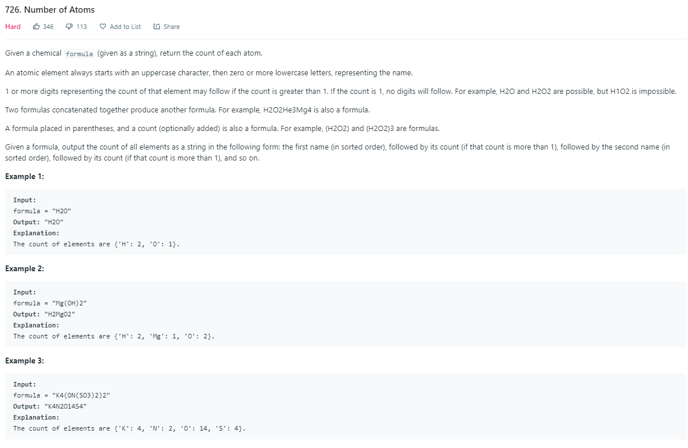

Solution:
```

```

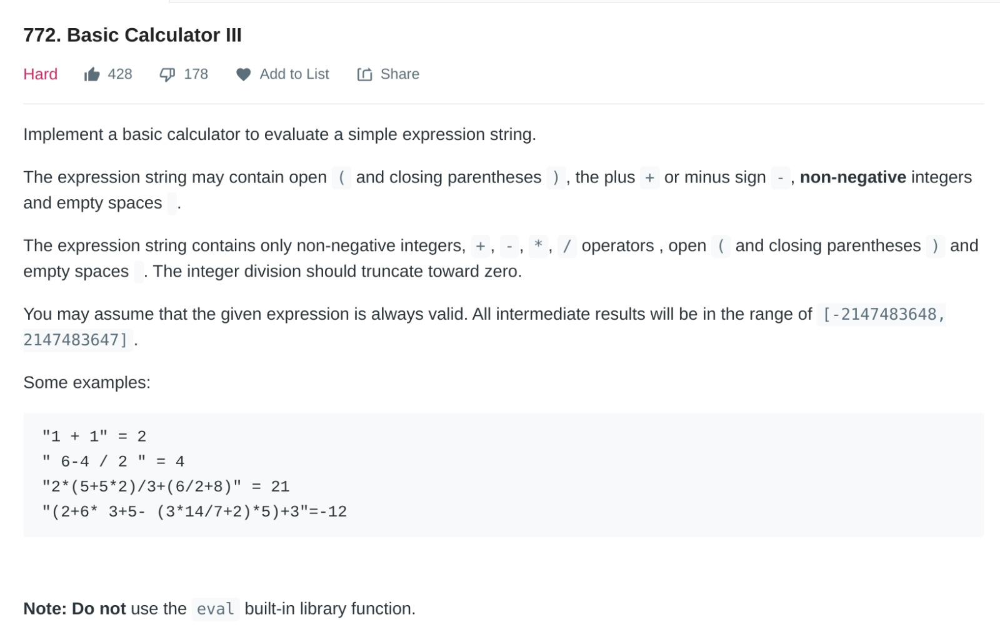

Solution:
```python
class Solution:
    def calculate(self, s: str) -> int:

        ## APPROACH : 2 STACKS ##
        ## SIMILAR TO LEETCODE 772. BASIC CALCULATOR III ##
        
        ## BELOW IS 100% SAME SOLUTION OF LEETCODE 772 ###

        def operation(op, second, first):
            if op == "+":
                return first + second
            elif op == "-":
                return first - second
            elif op == "*":
                return first * second
            elif op == "/":  # integer division
                return first // second
        
        def precedence(current_op, op_from_ops):
            if( op_from_ops == "(" or op_from_ops == ")" ):
                return False
            if(current_op == "*" or current_op == "/") and (op_from_ops == "+" or op_from_ops == "-"):
                return False
            return True
        
        if not s: return 0
        
        nums = [] if(s[0] !='-') else [0]                                       # edge case -1 + 2/3
        ops = []
        i = 0
        while i < len(s):
            c = s[i]
            if c == " ":
                i += 1
                continue
            elif c.isdigit():
                num = int(c)
                while i < len(s) - 1 and s[i + 1].isdigit():                    # more than 1 digit numbers
                    num = num * 10 + int(s[i + 1])
                    i += 1
                nums.append(num)
            elif c == "(":
                ops.append(c)
                if( i+1 < len(s) and s[i+1] == '-'): 
                    nums.append(0)                                              # "1 - (-7)" edge case.
            elif c == ")":
                while ops[-1] != "(":                                           # do the math when we encounter a ')' until '('
                    nums.append(operation(ops.pop(), nums.pop(), nums.pop()))
                ops.pop()                                                       # watch out, popping open brace '('
            elif c in ["+", "-", "*", "/"]:
                while len(ops) != 0 and precedence(c, ops[-1]):                 # check for precedence order and make calculations, APPEND RESULT TO NUMS STACK EVERY TIME.
                    nums.append(operation(ops.pop(), nums.pop(), nums.pop()))   
                ops.append(c)                                                   # append to operators stack
            i += 1                                                              # basic while loop increment
        
        while len(ops) > 0:                                                     # finally we perform calculations till stack is empty.
            nums.append(operation(ops.pop(), nums.pop(), nums.pop()))
            
        return nums.pop()
```

## Monotonous Increasing Stack
## Monotonous Decreasing Stack

