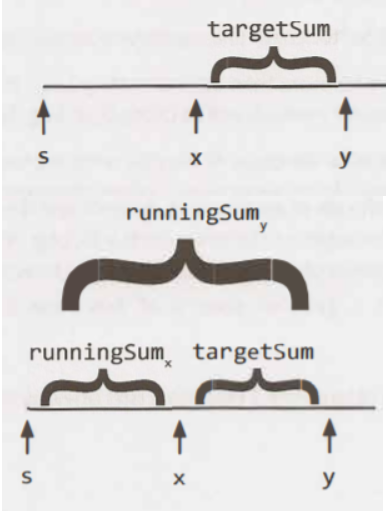

# Subarray

A subarray of an n-element array is an array composed from a contiguous block of the original array's elements. For example, if ```array = [1, 2, 3]```, then the subarrays are ```[1],[2],[3], [1, 2], [2, 3] and [1, 2, 3]```. Something like ```[1, 3]``` would not be a subarray as it's not a contiguous subsection of the original array.


Subarray questions fall under the following categories:

>+ [Kadane's Algorithm](#kadane's-algorithm)
>+ [Problems that can be solved using Hash Map](#problems-that-can-be-solved-using-hash-map)
>+ [Sliding Window or Two pointer Approach](#sliding-window-or-two-pointer-approach)
>+ [Problems that require storing the running sum/product or using dynamic programming concept](#problems-that-require-storing-the-running-sum/product-or-using-dynamic-programming-concept)

## Kadane's Algorithm

Kadane's Algorithm let you calculate the Maximum/Minimum subarray sum/product in O(N) time complexity. Kadane's Algorithm uses dynamic programmming concept to calculate the Maximum/Minimum subarray sum/product. Dynamic Programing lets you split the problem into multiple subproblems and storing their solutions using a memory-based data structure (array, map, etc.). So the next time the same sub-problem occurs, instead of recomputing its solution, one simply looks up the previously computed solution, thereby saving computation time.

Please refer the article to understand how the Kadane's Algorithm works - [Kadane's Algorithm Article](https://medium.com/@rsinghal757/kadanes-algorithm-dynamic-programming-how-and-why-does-it-work-3fd8849ed73d)

Some problems on Leetcode that can be solved using this concept:

### Easy

1. [53. Maximum Subarray
](https://leetcode.com/problems/maximum-subarray/)

### Medium

1. [918. Maximum Sum Circular Subarray](https://leetcode.com/problems/maximum-sum-circular-subarray/)

## Problems that can be solved using Hash Map

An example of this type of question is to count the number of subarrays having sum exactly equal to k.

```
Input       : arr[] = {10, 2, -2, -20, 10}, k = -10
Output      : 3
Subarrays   : arr[0...3], arr[1...4], arr[3..4]
              have sum exactly equal to -10.

Input       : arr[] = {9, 4, 20, 3, 10, 5},
              k = 33
Output      : 2
Subarrays   : arr[0...2], arr[2...4] have sum
              exactly equal to 33.
```

This type of questions can be solved using a Hashmap to store the running sum/product.



running_sum(x)   : Denotes the total sum from start(s)                position till x position.
running_sum(y)   : Denotes the total sum from start(s)                position till y position.
target_sum       : running_sum(y) - running_sum(x)
So at any position y we want to find if there were any running_sum(x) values in our path.
If there were such values then they denote the subarray sum that equals target value has been reached from point x to point y.
To store the running_sum values we use dictionary in python.

Some problems on Leetcode that can be solved using this concept:

### Medium Level

1. [523. Continuous Subarray Sum](https://leetcode.com/problems/continuous-subarray-sum/)
2. [525. Contiguous Array](https://leetcode.com/problems/contiguous-array/)
3. [560. Subarray Sum Equals K](https://leetcode.com/problems/subarray-sum-equals-k/)
4. [930. Binary Subarrays With Sum](https://leetcode.com/problems/binary-subarrays-with-sum/)
5. [974. Subarray Sums Divisible by K](https://leetcode.com/problems/subarray-sums-divisible-by-k/)
6. [1124. Longest Well-Performing Interval](https://leetcode.com/problems/longest-well-performing-interval/)
7. [1248. Count Number of Nice Subarrays](https://leetcode.com/problems/count-number-of-nice-subarrays/)
8. [1442. Count Triplets That Can Form Two Arrays of Equal XOR](https://leetcode.com/problems/count-triplets-that-can-form-two-arrays-of-equal-xor/)


## Sliding Window or Two pointer Approach

Please use the below link for the Sliding Window topic:
[SlidingWindow_TwoPointer](./SlidingWindow_TwoPointer.md)

## Problems that require storing the running sum/product or using dynamic programming concept

Some problems require calculating running_sum/product or storing the result of subproblems in a suitable datastructure in case of Dynamic Programming.

Calculation of running_sum/product:
```
Input            : [10, 2, -2, -20, 10]
running_sum      : [10, 12, 10, -10, 10]
running_product  : [10, 20, -40, -800, 8000]
```

Some problems on Leetcode that can be solved using this concept:

### Medium Level

1. [152. Maximum Product Subarray](https://leetcode.com/problems/maximum-product-subarray/)
2. [718. Maximum Length of Repeated Subarray](https://leetcode.com/problems/maximum-length-of-repeated-subarray/)
3. [769. Max Chunks To Make Sorted](https://leetcode.com/problems/max-chunks-to-make-sorted/)
4. [978. Longest Turbulent Subarray](https://leetcode.com/problems/longest-turbulent-subarray/)
5. [1109. Corporate Flight Bookings](https://leetcode.com/problems/corporate-flight-bookings/)
6. [1352. Product of the Last K Numbers](https://leetcode.com/problems/product-of-the-last-k-numbers/)

